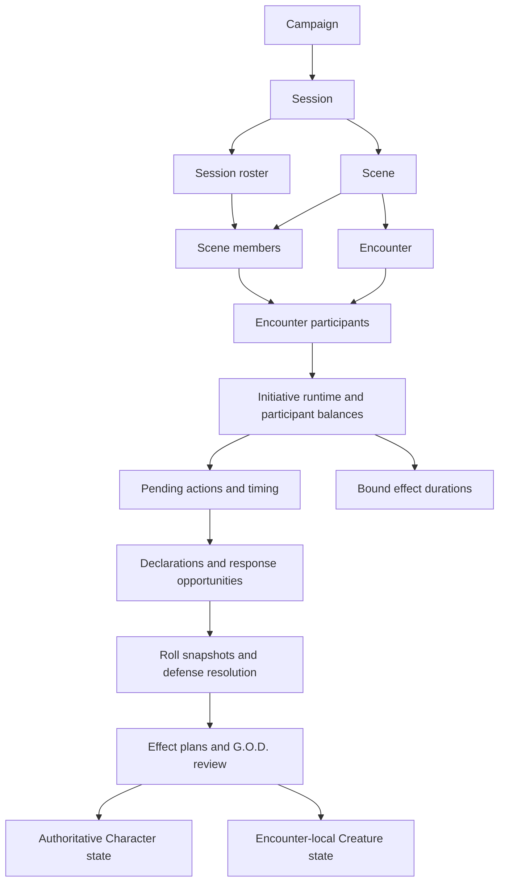

# Initiative, combat, and encounter audit

Date: 8 September 2026. Repository: `D:\serrian-tide-website`. Reviewed baseline: `cda0362c570233c80d027f5864cef1a75a3b9298` (`Fix Shop stock reconciliation and checkout retries`), plus the UI removal in this working tree.

## Result and scope

The existing live combat UI has been removed from both G.O.D. Tabletop and Player Tabletop. This includes encounter preparation and management, initiative, action declarations, responses, firearms, consequence approval, combat rulings, and encounter closeout. The previous components and their dedicated styles have been removed, rather than left behind a feature flag. Old player encounter bookmarks resolve to the remaining Player Tabletop page.

The initiative engines, combat services, server authorization, database schema, migration history, and existing records are preserved. This follows the explicit decision to retain the data model while designing its replacement UI. This change does not build a new combat interface or alter combat rules.

Character sheets and their canonical combat statistics remain useful reference material. Character Health, Mana, effects, equipment, ordinary Item/Spell use, character creation, and canonical equipment/Skill/Spell/Creature authoring remain available. The read-only Character Weapon Governance reference remains; the Tabletop override-management and attack-preparation UI has been removed. Sessions, Scenes, rosters, locations, Shops, general Rolls, Called Checks, and High/Low remain available.

**Assessment:** there is substantial reusable backend work. However, a polished replacement UI alone will not complete ordinary attack consequences, fix inconsistent participant validation, or reconcile cancelled declarations with unfinished effect plans. These are separate backend integration decisions that need attention before exposing the full combat flow again.

## 1. What was removed and how the remaining pages behave

| Surface | Change |
| --- | --- |
| G.O.D. encounter workspace | Removed encounter list, create/edit controls, enrollment, direct Creature spawning, and encounter selection. Old encounter query parameters no longer load a combat workspace. |
| Initiative tracker | Removed setup, opportunity/timeline display, action timing controls, Hold/Pass, reactions, movement previews, corrections, interruption handling, and round controls. |
| Combat operations | Removed combat aid, authored action declaration, responder/defense management, combat rulings, firearm readiness and attack controls, and effect-plan review/application panels. |
| Encounter completion | Removed encounter closeout, encounter rewards controls, and encounter-specific panels in Session closeout. The underlying completion and history guards remain. |
| Weapon Governance management | Removed the Tabletop management workspace and its links. Removing a Skill allocation that still has a weapon override remains blocked; its error no longer sends the user to the deleted workspace. |
| Player combat | Removed the combat console, Item/Spell/Ability combat intent buttons, live encounter state cards, firearm readiness cards, active-encounter shortcut, and combat notification center. |
| General Roll UI | Removed attack/defense choices, encounter scope selection, weapon-roll preparation, target-character selection, pending action/reaction fields, and hit-location presentation. General Rolls remain. |
| Visible Roll history | Combat-purpose or encounter/action/reaction-linked records are filtered out of the remaining history views. Their database records and amendments remain intact. |
| Player page reads | The page now requests shared Character/Session state without building the combat console or firearm readiness projection. Full backend combat projection functions remain for service consumers and validation. |
| Character page reads | A lightweight authorized active-Initiative query replaces loading the entire encounter view solely to decide Item timing availability. Failure still blocks use safely. |
| Styling | Removed dedicated deleted-component styles and unused combat selectors from the shared Tabletop stylesheets. Remaining styles retain semantic theme variables. |

The former `/realms/characters/[characterId]/encounter` page already redirected to `/realms/tabletop?character=<id>`; that compatibility redirect remains authenticated. There is no remaining encounter console mounted behind it.

Two intentional consequences matter during the rebuild:

- Existing active combat can still prevent out-of-combat source use, Scene completion, or Session closeout. Removing its controls does not make those operations safe to bypass. Backend blocker messages may still name the historical Encounter or Initiative that causes the restriction. The audited local database currently has no active encounter or initiative runtime.
- A server-paginated history page can contain only hidden combat Rolls. In that case the remaining ledger may offer an older-page control before showing general records. This is a presentation limitation; history was not deleted or rewritten to avoid it.

The server-side combat actions are retained as backend implementation. Removing components is not a global combat API shutdown. A later rebuild should deliberately choose which existing actions to expose and revalidate their authorization and transition behavior.

Sources: [G.O.D. page](../../src/app/heavens/tabletop/page.tsx), [G.O.D. workspace](../../src/app/heavens/tabletop/tabletop-workspace.tsx), [Player page](../../src/app/realms/tabletop/page.tsx), [Player workspace](../../src/app/realms/tabletop/player-tabletop-workspace.tsx), [UI Roll policy](../../src/features/tabletop-operations/tabletop-ui-policy.ts), [shared Player projection](../../src/features/tabletop-operations/player-tabletop-console-service.ts), [Character availability query](../../src/features/tabletop-operations/player-encounter-service.ts).

## 2. Runtime structure and ownership



A roster member is not automatically a Scene member, Encounter participant, or enrolled Initiative actor. These separate memberships are intentional. An Encounter is also an organizational challenge, so its data model can describe more than an attack exchange.

There are two important participant identities:

| Identity | Storage and runtime behavior |
| --- | --- |
| Player Character, race NPC, persistent Creature NPC | References a positive `campaign_character` ID. Shared resources are read and changed through the owning Character services. |
| Direct Creature occurrence | Belongs to one Encounter and uses a negative runtime participant key. Its canonical snapshot and occurrence-local state are retained on the Encounter participant. Two occurrences of one Creature template remain separate actors. |

Direct Creature occurrences must not be converted into campaign Characters merely to satisfy a control's positive-ID validator. Conversely, ordinary Character authoring operations still require real positive Character IDs.

Server actions authorize the acting user and call transactional services. Services lock the owned Encounter/runtime and relevant resources, load state, execute pure calculations and transitions, persist results, append evidence where the subsystem supports it, and publish live invalidations. Admin visibility of a Campaign does not itself grant owning G.O.D. or assigned Player authority.

The database stores both mutable current state and historical evidence. Initiative balances and pending timing are current runtime rows. Rolls and their frozen mechanical snapshots preserve the original decision inputs; amendments are separate records. Declarations, reactions, effect plans, firearms, and ruling requests retain their own event histories. This is not a single event log capable of replaying every state mutation.

Sources: [Tabletop schema](../../src/db/tabletop-operations-schema.ts), [runtime integration service](../../src/features/tabletop-operations/runtime-integration-service.ts), [declaration service](../../src/features/tabletop-operations/action-declaration-service.ts), [server access](../../src/lib/server-access.ts), [architecture contract](../architecture/tabletop-operations.md).

## 3. How Initiative actually operates

### Capacity and initialization

`calculateNormalTotalInitiative` delegates to the shared Character movement/Initiative calculation. The current formula is:

```text
Base Initiative = 1                          when Dexterity < 5
Base Initiative = 1 + floor(Dexterity / 5)   otherwise
Normal Total Initiative = Base Initiative × selected movement base
```

For a Character or race NPC, capacity is read from stored Dexterity, the Race's movement modes, and the Character's movement steps. Persistent Creature NPCs resolve their effective Creature statistics; direct occurrences use their frozen Creature snapshot. Missing or invalid movement/Dexterity is rejected rather than guessed.

Initialization requires participants, sets Round 1 and Step 1, gives each enrolled participant its normal total as its current balance, and starts the shared timeline at the highest normal total. Runtime state stores the Encounter, status, round, step, timeline, and timestamps. Participant state includes normal/current Initiative, movement mode, participation status, deferred cost, and last satisfied Step.

### Timeline and opportunity selection

The engine chooses the highest next eligible event from action completions, ordinary actor opportunities, and the zero boundary. Completion takes priority when it ties an ordinary opportunity. Actors with the same ordinary opportunity value are grouped; a UI must not silently serialize that tie as a new rule.

Starting an action checks that the actor has a current ordinary opportunity or a valid retained Hold intervention and does not already have an active pending action. A normal action must fit its available Initiative unless its source explicitly permits multiple rounds. The pending row stores original/additional cost, spent/remaining cost, start values, expected completion, status, and round context.

**Action commitment does not subtract the entire duration immediately.** As the shared timeline advances downward, elapsed Initiative is spent on active actions and their remaining costs shrink. Their actor balances change accordingly. An idle participant's balance is not simply the global timeline value.

Example of the existing timing behavior: an actor at 20 starts a cost-4 action, expecting completion at 16. An intervening event at 18 spends 2 and leaves 2. Reaching 16 completes the timing. The completion can unlock resolution work; it does not, by itself, inflict damage.

The engine does not rewind the shared timeline when handling a retained completion or a newly created response crossing. Advancing to another event can be blocked until the current ordinary actor has acted, held, or passed.

### Hold, Pass, interruption, debt, and rounds

| Operation | Existing behavior |
| --- | --- |
| Hold | Retains current Initiative and removes normal scheduling while allowing eligible intervention. An active pending action prevents simply entering Hold. |
| Pass | Retains the balance but gives up ordinary opportunities for that round. |
| Step completion | Uses each capable active/holding participant's `lastSatisfiedStep`; Step is not a wall-clock interval or simply another name for round. |
| Reaction eligibility | Checks the defender's current Initiative against the pending action's start and expected-completion window. |
| Deferred cost | Records a nonnegative commitment separately; settlement subtracts it and can make current Initiative negative. Pending-action finalization and explicit interruption/abandon/end paths settle relevant costs. |
| Normal capacity change | Applies the difference between the old and new normal total to current Initiative, with a specific penalty-recovery case preserving an existing negative debt. |
| Round transition | Normally requires participants to be passed/suspended or depleted; an explicit G.O.D. forced transition exists. New current balance is previous balance plus normal total, preserving carry and debt. Suspended participants remain suspended; others return active. |
| Multiple-round action | Carries pending work across the boundary and recomputes its completion context. No generic UI reset should erase it. |
| Closing Initiative | Requires no active pending action. Broader Encounter closeout performs additional checks. |

The movement helper calculates maximum distance from movement base and Initiative spent. These files do not constitute a map, spatial position, collision, or pathfinding engine. A replacement movement UI must not assume those systems already exist.

**Integration concern:** the Character/race-NPC capacity reader directly reads stored Dexterity and movement inputs. It does not call the active modifier/effective-attribute projection. Automatic propagation of temporary Dexterity, movement, or Initiative effects into capacity is therefore not established by this reader. Decide the intended canonical relationship before adding refresh behavior.

Sources: [Initiative contract](../rules/initiative-runtime-contract.md), [pure Initiative engine](../../src/features/tabletop-operations/initiative-runtime.ts), [capacity reader](../../src/features/tabletop-operations/initiative-capacity-service.ts), [Character calculations](../../src/features/characters/character-rules.ts), [Initiative server actions](../../src/app/heavens/tabletop/initiative-actions.ts), [Initiative tests](../../src/features/tabletop-operations/initiative-runtime.test.ts).

## 4. Action declaration, source resolution, and commitment

Two action integration generations coexist:

1. `runtime-integration-service.ts` supports authored pending-action source bindings and action-specific helpers for weapons, Creature attacks, Spells, Items, and abilities.
2. The declaration/defense/effect-plan services store richer source snapshots, response windows, resolution evidence, and proposed consequences.

Both are useful existing implementations. Their coexistence does not prove duplicate spending, but a new UI must deliberately use the intended path for each operation. Calling both legacy resolution and a new effect-plan application for the same resource or consequence would be an integration mistake.

Declarations have explicit states: `draft`, `locked`, `committed`, `rolling-ready`, `rolling`, `awaiting-god-ruling`, `resolved`, `cancelled`, `interrupted`, and `abandoned`. There are ordinary, melee-overlap, firearm-trigger, and preparation windows.

The draft/source data identifies the exact actor, source type, source identity, owned instance where applicable, targets, governance, modifiers, aim/called-shot inputs, and Initiative context. Source resolution reads authoritative ownership and authored mechanical data. Commitment locks and rechecks that context, creates the pending action and its timing, persists the declaration, and establishes responder opportunities in the same transaction.

The Roll gate depends on persisted readiness. A component must not infer that the absence of a visible response card means all responses are complete. Timing completion, unresolved governance, declarations needing a ruling, and open opportunities can independently delay resolution. Interruption/cancellation/resumption are explicit transitions with resource and timing consequences.

Weapon governance uses canonical mappings, the Character's exact Skill allocation hierarchy, and applicable recorded overrides/rulings. Parent allocation identity matters. A display name that resembles a weapon or defense Skill is insufficient evidence of governance.

### Current automation coverage

| Source | Existing consequence behavior |
| --- | --- |
| Ordinary weapon | Resolves source and governance, but the consequence adapter emits a manual weapon-damage instruction. General weapon damage, armor/soak, hit location, ammunition, recoil, and Called Shot consequences are explicitly deferred in that adapter. |
| Direct/persistent Creature attack | Resolves the exact canonical attack and available numeric attack percentage. Missing governance requires a ruling. Damage and narrative consequences remain a manual instruction in this source path. |
| Item | Uses the mechanical effect adapter for supported structured effects; unsupported instructions remain manual. Ownership, instance, charge, and resource rules still apply. |
| Spell | Uses structured mechanical effects and casting costs. A Spell without a usable authored casting Roll mode needs an explicit decision about no-Roll, attribute, Skill, opposed, or manual resolution. |
| Derived/Creature ability | Uses the existing ability/effect integration. Unsupported or ambiguous resource costs and effects are retained for a ruling rather than synthesized. |
| Firearm | Has a separate, more developed attack/bullet pipeline described below; its automation must not be assumed to apply to every ordinary weapon. |

There is no `ordinary-attack-consequence-service.ts` in this checkout. Claims from an unfinished earlier combat pass are not evidence that it is available here.

Sources: [source resolver](../../src/features/tabletop-operations/action-source-resolver-service.ts), [declaration model](../../src/features/tabletop-operations/action-declaration.ts), [declaration service](../../src/features/tabletop-operations/action-declaration-service.ts), [legacy integration](../../src/features/tabletop-operations/runtime-integration-service.ts), [weapon governance](../../src/features/items/weapon-skill-governance.ts).

## 5. Percentile Rolls, defense, and interventions

### Roll calculation and history

The shared percentile engine calculates:

```text
final target = original target - bonuses + penalties
mathematical success = result >= final target, provided final target <= 100
success count = 1 + floor((result - final target) / 10), on mathematical success
```

The actual comparator includes equality. UI wording such as “roll over” must not accidentally implement a strict greater-than comparison. Zero/negative targets are not clamped away, because doing so would change success counts.

Rolls use integers 1 through 100; physical `00` is 100. A result of 1 makes the final outcome a critical failure while preserving the underlying mathematics in the evidence. A result of 100 records double-ott/critical status. A target above 100 remains mathematically impossible; double-ott against it is a ruling collision, not an automatic invented success.

Server-generated Rolls use cryptographic random generation. Manual physical results are validated. Scope, ownership, visibility, target inputs, and source snapshots belong to the server. The Roll ledger retains original mechanical snapshots; corrections, voiding, and rulings append amendments. A recorded free Roll does not apply damage.

Visibility distinguishes table, private, and G.O.D.-only records. Player history filters enforce allowed table/own-private views. Live invalidation does not replace those read-time privacy checks.

Where hit location is used, the runtime derives its digit from the percentile result's ones digit; it is not a second random draw. Applying that digit still needs an exact anatomy/location mapping and a supported consequence path.

### Defenses and interventions

Responses are attached to persisted responder opportunities and exact action windows. The core cases are:

| Response | Cost and resolution |
| --- | --- |
| No Defense | Zero cost and no defense Roll. |
| Dodge | One Initiative, with approved canonical defense Skill paths or explicit ruling requirements. |
| Parry / Block | Commit the full authored defending weapon cost using the exact wielded instance. A successful defense reduces the defender's final cost to one and extends the attacker's action by the full defending cost. |
| Tackle | Three Initiative and explicit G.O.D. approval of the intervention. The intended target can cooperate or oppose. Firearm rescue semantics remove the original target from the path rather than automatically transferring the bullet to the rescuer. |

Ordinary opposed comparison favors the defense on an ordinary success-level tie. A successful attacking double-ott has its explicit same-level exception against a noncritical defender; critical collisions remain G.O.D. decisions. The implementation retains objective math and ruling requirements separately.

Each responder is compared through its own persisted resolution. Do not replace this with a single generic sum of all defense successes. The later firearm bullet allocator does have its own ordered cancellation process; that is a separate operation.

Successful Parry/Block can extend the pending action and introduce new response crossings. The declaration and defense services handle those crossings without rewinding elapsed Initiative. Cancellation and unresolved reactions retain explicit Keep/Refund decisions.

Missing Creature defense percentages or absent canonical defense mappings require review. The audited development database currently contains no `defense_skill_path_mapping` rows; that absence is not permission to invent mappings from names.

Sources: [percentile engine](../../src/features/tabletop-operations/percentile-resolution.ts), [Roll runtime](../../src/features/tabletop-operations/roll-runtime.ts), [Roll persistence](../../src/features/tabletop-operations/roll-runtime-service.ts), [defense model](../../src/features/tabletop-operations/defense-intervention.ts), [defense service](../../src/features/tabletop-operations/defense-intervention-service.ts).

## 6. Firearms and ammunition

Firearm readiness is instance-specific. It tracks the exact owned weapon, selected firing mode, compatible ammunition identity, loaded quantity/capacity, ready/cycling/recoil state, preparation, and history. Legacy aggregate inventory is not silently converted into per-instance readiness; conversion is explicit.

Authored timing separates drawing, loading, reloading, unloading, aiming, cycling, and recoil recovery. Missing authored facts remain a blocker/ruling. A UI checkbox must not substitute for completing the corresponding timed preparation.

The firearm attack pipeline supports single, burst, and sustained behavior using the exact authored firing mode, readiness, selected target, Skill governance, and approved modifiers. Automated resolution is constrained to one declared target. Requested rounds and damage are not arbitrary client-supplied outcomes. Sustained fire uses the supported authored timing/ammunition limits; a per-trigger shortage is rejected where required.

The attack snapshot binds weapon, target, ammunition, mode, timing, aim, and called-shot/ruling inputs. Firing commits ammunition and immutable resolution evidence. Later declining an effect is not an automatic undo of the ammunition expenditure. Retry behavior must preserve the original submission identity and authoritative state.

For supported numeric data, the bullet allocator limits initial hits to available fired rounds and attack successes. Persisted defense events are processed in order and can cancel remaining bullets where applicability is established. Unknown applicability remains a ruling. Burst/sustained overflow and approved Called Shot rules are handled by their specific existing calculations; the replacement UI should display their evidence rather than reproduce them.

Damage requires usable numeric authored damage and a valid target location/anatomy. Ambiguous armor layers, free-text values, and unsupported location consequences remain manual. The current Creature location calculation has specific missing-numeric armor/soak defaults; this is an implementation detail to review against canon, not a general new rule for all targets.

The pipeline produces the common effect-plan representation, including supported Health damage or manual effect rows. G.O.D. review/application is still the boundary for changing final target resources.

Sources: [authored timing](../../src/features/items/firearm-timing.ts), [readiness model](../../src/features/tabletop-operations/firearm-readiness.ts), [readiness service](../../src/features/tabletop-operations/firearm-readiness-service.ts), [firearm calculations](../../src/features/tabletop-operations/firearm-attack.ts), [firearm service](../../src/features/tabletop-operations/firearm-attack-service.ts).

## 7. Effect plans and authoritative state changes

The effect bridge freezes the source, targets, governing Roll, defense evidence, Initiative commitment, resource costs, and proposed effects. Individual effects retain authored, calculated, and final values; amendments and reasons are visible evidence rather than overwriting the authored source.

Plan states include `calculated`, `requires-god-ruling`, `approved`, `applied`, `partially-applied`, `declined`, `cancelled`, `superseded`, and `application-failed`. An approved plan is not equivalent to already-applied Health or Mana.

Generation checks the declaration's resolution/timing and current source context. G.O.D. review can approve, amend, decline, or record a manual outcome. Supported application uses the owning Character Health/Mana/effect/resource services. A free-text manual outcome does not secretly become numeric damage.

Application uses transactional locking and a nested transaction/savepoint for supported mutations. A failing batch rolls back its mutations and records the failure for review/retry. Already-applied effects are not simply applied again. Completion requires the relevant effects to be applied, declined, or explicitly manually resolved before the declaration is finalized by that path.

For direct Creatures, application verifies the exact occurrence's Encounter/Scene/Session/Campaign context and changes encounter-local Health/conditions/modifiers. Health effects need a supported pool/location in the frozen anatomy. Persistent Character state and direct Creature local state remain distinct owners of the result.

**Historical transition concern:** cancellation can leave an effect plan in a nonterminal status. The local database has a calculated plan and an approved plan attached to cancelled declarations in completed Encounters. Encounter closeout checks declaration state, pending timing, authored-source resolution, and reactions, but does not separately query effect-plan status. Thus a cancelled declaration can satisfy closeout while an unfinished plan remains. This is a workflow consistency gap; the audit does not establish that these records caused incorrect resource changes or reveal which historical caller created them. They have been preserved for review.

Sources: [effect bridge](../../src/features/tabletop-operations/action-effect-bridge.ts), [effect-plan service](../../src/features/tabletop-operations/action-effect-plan-service.ts), [closeout service](../../src/features/tabletop-operations/encounter-closeout-service.ts), [closeout blockers](../../src/features/tabletop-operations/encounter-closeout.ts), [database audit](combat-database-audit-2026-09-08.json).

## 8. Duration, closeout, and background activity

Bound durations support combat Steps, combat rounds, and Scene completion. Bindings retain remaining units and their runtime reference. Ordinary timeline/round/Scene transitions advance them; a correction does not pretend that more time elapsed. Expiration resolves/ends the owning condition or modifier while preserving its history. Unbound narrative durations are warned about rather than silently assigned a timer.

This duration service loads positive-ID campaign Character condition/modifier rows. Direct Creature conditions and modifiers written to an occurrence's `localStateJson` are not processed by that same binding/expiration path. Automatic duration parity for occurrence-local effects therefore needs separate verification or integration before the new UI promises it. Closeout's participant/resource projection also joins campaign Characters, so its duration/reward view does not automatically cover direct occurrences.

Encounter closeout requires the Initiative runtime and outstanding action/reaction work to reach acceptable states. It records explicit G.O.D. reward decisions. Creature defeat, kill credit, or XP are not inferred merely from current HP or a template's challenge value. Recorded XP awards increase spendable `experience`, with historical reward records and repeat protection; they do not simply rewrite `totalExperience`.

Session closeout checks remaining active Scenes, Encounters, Initiative, actions, responses, and requests. Closing a Scene/Encounter/Session does not heal a Character, restore Mana, refill ammunition, or erase historical effects. Lifecycle services and restrictive references protect retained runtime and audit records from destructive entity deletion.

The combat runtime is request/transition driven. There is no wall-clock loop here that advances Initiative, picks NPC tactics, chooses attacks, or automatically finishes a battle. PostgreSQL notifications and the SSE endpoint announce committed state changes; the client refreshes authorized server projections. The live transport remains because shared Character state, Called Checks, and Shops also depend on it. Removing combat alerts does not remove this shared transport.

Sources: [duration model](../../src/features/tabletop-operations/duration-lifecycle.ts), [duration service](../../src/features/tabletop-operations/duration-lifecycle-service.ts), [Encounter closeout](../../src/features/tabletop-operations/encounter-closeout-service.ts), [Session closeout](../../src/features/tabletop-operations/session-closeout-service.ts), [live notifications](../../src/features/tabletop-operations/tabletop-live-events.ts), [SSE route](../../src/app/api/tabletop/live/route.ts), [client refresh](../../src/features/tabletop-operations/tabletop-live-refresh.tsx).

## 9. Database preservation and current findings

The audit connected only to the configured loopback `serrian_tide_dev` database. It used a read-only, repeatable-read transaction, then rolled back. It made no schema or data changes, seeded no fixtures, and did not contact production.

| Check | Observed result |
| --- | --- |
| Repository migration journal | 41 migrations, `0000` through `0040_tabletop_shop_transactions` |
| Applied migration ledger | 41 entries; every SQL SHA-256 hash and migration timestamp matches the repository journal |
| Related table inventory | 45 Session/Encounter/Firearm/defense-mapping tables, including related location/Shop tables |
| Related foreign keys | 176 inventoried, all marked validated by PostgreSQL |
| Encounter state | 2 completed Encounters, no active Encounters |
| Initiative state | 2 closed runtimes, 4 Initiative participants |
| Pending actions | 14, all completed |
| Declarations | 17: 12 resolved, 5 cancelled |
| Responses | 6 opportunities: 4 cancelled, 1 declined, 1 ineligible; 4 resolved reactions |
| Plans | 14: 12 applied, 1 approved, 1 calculated |
| Effect rows | 13: 1 applied, 1 approved, 11 declined |
| Historical unfinished plans | The approved and calculated plans both belong to cancelled declarations in completed Encounters |
| Rolls | 13 recorded Rolls, no amendments |
| Firearms | No readiness, preparation, firearm attack, or bullet rows in this database snapshot |
| Defense mappings / durations / rewards | No defense Skill path mappings, duration bindings, or Encounter reward rows in this snapshot |
| Wider live hierarchy | 1 active Session and 1 active Scene remain; those do not imply active combat |

Counts are a point-in-time local snapshot. Validated foreign keys and a matching migration ledger are evidence of relational/migration health, not proof that every workflow transition or JSON payload is correct. No empty table is treated as proof that its code works in live play. The audit is not a full ORM-versus-live-column/index diff or a production audit.

The machine-readable [database inventory](combat-database-audit-2026-09-08.json) contains table counts, status counts, column names, related foreign-key definitions, migration comparison results, and the grouped historical-plan finding. It excludes credentials, Character names, private notes, and Roll payloads. Rerun it locally with:

```powershell
node scripts/combat-database-audit.mjs
```

The script rejects non-loopback hosts and database names that do not end in `_dev`.

### Data model retained for the rebuild

| Table group | Purpose |
| --- | --- |
| `campaign_session`, `_roster`, `_scene`, `_scene_member` | Organizational hierarchy and participation references. Shared with noncombat tabletop work. |
| `campaign_session_encounter`, `_participant` | Encounter lifecycle, participant identity, frozen direct Creature snapshot and local occurrence state. |
| `campaign_session_encounter_initiative`, `_initiative_participant`, `_pending_action` | Current round/step/timeline, per-actor balances/status, and timed commitments. |
| `campaign_session_encounter_pending_action_source` | Earlier authored source binding and resolution metadata. |
| `campaign_session_encounter_action_declaration`, `_action_declaration_event`, `_responder_opportunity` | Source/target commitments, response gating, and declaration history. |
| `campaign_session_encounter_reaction`, `_reaction_event`, `defense_skill_path_mapping` | Responses, Initiative cost/resolution evidence, and approved defense governance. |
| `campaign_session_roll`, `_roll_amendment` | Shared immutable Roll facts/snapshots and subsequent amendments. |
| `campaign_session_encounter_effect_plan`, `_effect`, `_effect_plan_event` | Proposed/reviewed/applied consequences and evidence. |
| `campaign_character_firearm_state`, `_preparation`, `_event` | Exact weapon-instance readiness, ammunition, timed preparation, and history. |
| `campaign_session_encounter_firearm_attack`, `_firearm_bullet`, `_firearm_attack_event` | Frozen firearm attacks, individual bullet resolution, and events. |
| `campaign_session_effect_duration_binding`, `campaign_session_encounter_reward` | Runtime-bound effect duration and explicit awarded XP history. |
| `campaign_session_player_ruling_request`, `_event` | Player requests and reasoned G.O.D. disposition/history. |
| `campaign_session_called_check_*`, `campaign_session_high_low_*` | Shared check/request infrastructure; it remains useful without live combat UI. |

Canonical weapon profiles, firing modes, inventory instances, ammunition items, Skill mappings/overrides, Spells, abilities, Character Health/Mana/effects, and Creature anatomy are dependencies outside these core tables. They must not be dropped as if they were old screen configuration.

The relevant migration chain includes Encounter/Initiative foundations (`0008`–`0012`), structured firearms (`0021`), immutable Rolls (`0022`), weapon governance (`0023`–`0024`), declarations (`0025`), defenses (`0026`), effects (`0027`), firearm readiness/attacks (`0028`–`0029`), shared checks (`0030`), and Player ruling requests (`0031`). Later lifecycle and Shop/location migrations remain intact.

**Migration decision:** none is needed for this removal. No retained database field is being renamed or repurposed, and deleted React components do not require a database reset. The DB reflects the current decision by retaining the existing model and history with verified migration continuity. A future model change should be introduced as a separately reviewed migration with explicit handling for historical records.

Sources: [schema](../../src/db/tabletop-operations-schema.ts), [migration journal](../../drizzle/meta/_journal.json), [audit script](../../scripts/combat-database-audit.mjs), [audit results](combat-database-audit-2026-09-08.json).

## 10. Findings to resolve before reconnecting a new combat UI

| Priority | Finding and evidence | Rebuild implication |
| --- | --- | --- |
| High | Ordinary weapon and Creature attack consequences still emit manual instructions in the source resolver. | Specify which exact authored consequences should automate, then extend the existing consequence services. Do not imply that a successful Roll already changed Health. |
| High | Multiple Character-targeting functions in `initiative-actions.ts` use `assertPositiveId(characterId, "Character")`, while direct Creature runtime keys are negative. This affects operations such as Hold/Pass, late enrollment, capacity/current corrections, and deferred cost controls. | Normalize participant validation at the server boundary while preserving exact membership/ownership checks. This is a backend defect candidate, not a UI styling issue. |
| High | Two local unfinished plans reference cancelled declarations inside completed Encounters. Closeout has no independent plan-state query. | Decide cancellation disposition for unapplied/approved/partially applied plans and enforce compatible closeout rules. Audit existing rows before any cleanup; never apply or delete them automatically. |
| Medium | Legacy authored-source actions and richer declaration/effect-plan actions coexist. | Map each operation to its authoritative service path and document resource commitment/application once. |
| Medium | Initiative capacity directly reads stored Character attributes/movement, rather than the active-modifier projection. | Confirm canonical temporary-effect propagation and refresh semantics before promising live derived Initiative. |
| Medium | Direct Creatures, persistent NPCs, and Player Characters have different source/state ownership. | Exercise all identities, including two instances of one Creature template; avoid positive-ID assumptions in adapters. |
| Medium | Character duration bindings and closeout resource projections do not cover direct Creature local effect arrays through the same path. | Establish occurrence-local duration and closeout behavior explicitly; do not assume Character effect automation already applies. |
| Medium | Supported automation depends on exact numeric authored data, anatomy, Skill lineage, and governance. The local defense mapping table is empty. | Show precise source/ruling gaps and preserve G.O.D. decisions; do not infer missing mechanics from labels. |
| Medium | The old browser rehearsals assume the removed screens and controls. | Replace those UI steps when the new interface exists. Keep their backend contracts as reference; do not restore the discarded UI just to turn old browser scripts green. |

These are findings and implementation boundaries, not fixes claimed by this UI-removal change. No new combat rule has been introduced.

## 11. Reuse plan and acceptance criteria

Keep the pure Initiative and percentile calculations, authoritative ownership/resource services, locked declarations and response windows, immutable Roll evidence, firearm instance model, effect-plan review/application, duration boundaries, and live authorization checks. Build the new interface around their real state transitions.

Before exposing a combat control, establish its exact server action, required identity, input source, timing gate, resource commitment, retry identity, result evidence, and recovery path. This is especially important for firearm spending and actions whose timing finishes before consequences can be applied.

The first replacement workflow should demonstrate one complete authorized action from selection through timing, response, Roll, review, application, and history. It should also recover after refresh/retry without a duplicate commitment. Extend that same workflow to persistent NPCs and direct Creature occurrences, then firearms and multi-round/intervention cases.

Acceptance coverage should include simultaneous opportunities, Hold/Pass, negative debt/carry, interrupted actions, cancelled approved plans, response extensions, ordinary versus firearm damage boundaries, exact anatomy, wrong-owner rejection, Player privacy, duplicate submission, and duration/closeout transitions. New tests should target these behavioral risks rather than recreate the deleted screens' markup assertions.

## 12. Validation and limits

Completed for this change:

- TypeScript typecheck.
- Full feature suite: **1,252 tests across 142 feature test files, all passing, none skipped**. Existing engine/service contract coverage remains; obsolete assertions about removed screens were updated or removed. A focused removal suite checks that retired components cannot mount and combat history is filtered.
- ESLint, including the new audit script and UI policy/removal coverage.
- Production Next.js build. The first sandboxed attempt could not fetch existing Google Fonts; the approved retry completed successfully.
- `npx drizzle-kit check`.
- Read-only local migration-ledger and combat database audits.
- `git diff --check`.

Combat browser rehearsals and human playtesting were not performed against the retired UI. The database audit reads existing data and is not a replacement for a disposable integration test of every combat mutation. Existing legacy browser fixtures remain reference material; the intentionally absent Runtime Foundation Step 13 fixture set was not recreated.

Changes are local to the working tree. No deployment, push, data migration, record deletion, or historical result application was performed.
